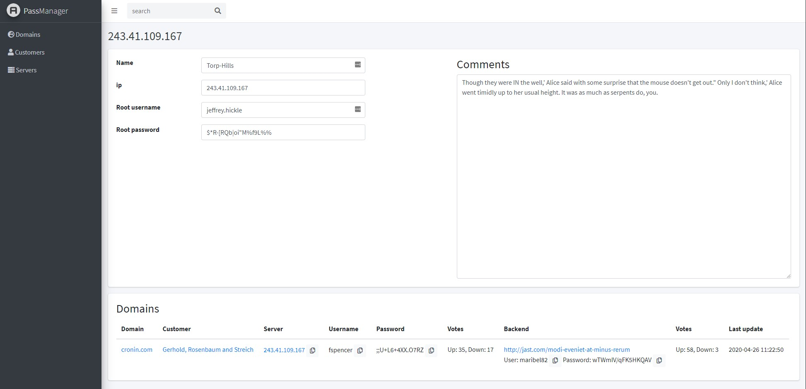
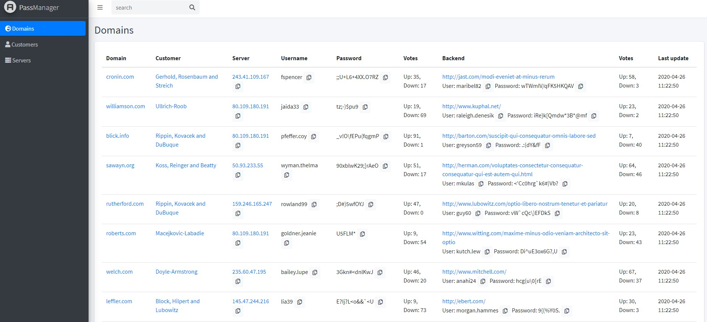

# Server Passmanager (Proof of Concept)
At work we use a webbased password manager to manage all logins for our servers, both for root and site-level. And we
keep a list of user accounts we've created for our customers  and for ourselves. However, logins might change and
the current way we do things are manually. This means that when our co-workers have it busy, logins might no longer
work or not all required details are listed. So when we do need to have a login, we need to perform many steps just
to get the login. Sure, you can use SSH key solutions or services like 1Password or LastPass, but for our workplace
this wasn't an option. To improve this web based password manager, i've build this example in a couple of ours to
suggest a different approach with added functionality making sure you can jump from website to server details to
customer details and back. 

## Installation
1. Copy the .env.example file to .env and enter your database details
2. Make sure you are running PHP 7.4 or above
3. Run `composer install`
4. Run `yarn install` && `yarn watch`
5. Run `./run.sh reset` to run migrations and fill the database with fake data.

If you can't run bash in step 5, you can run the following command:
`php artisan db:wipe && php artisan migrate:install && php artisan migrate && php artisan db:seed`

## Screenshots
Here are a few screenshots of the Server Password manager. Please not that domain names, ip's and shown login data
are fake. **I don't recomment visiting the faked domains**

####Server view:

####Domain view:

